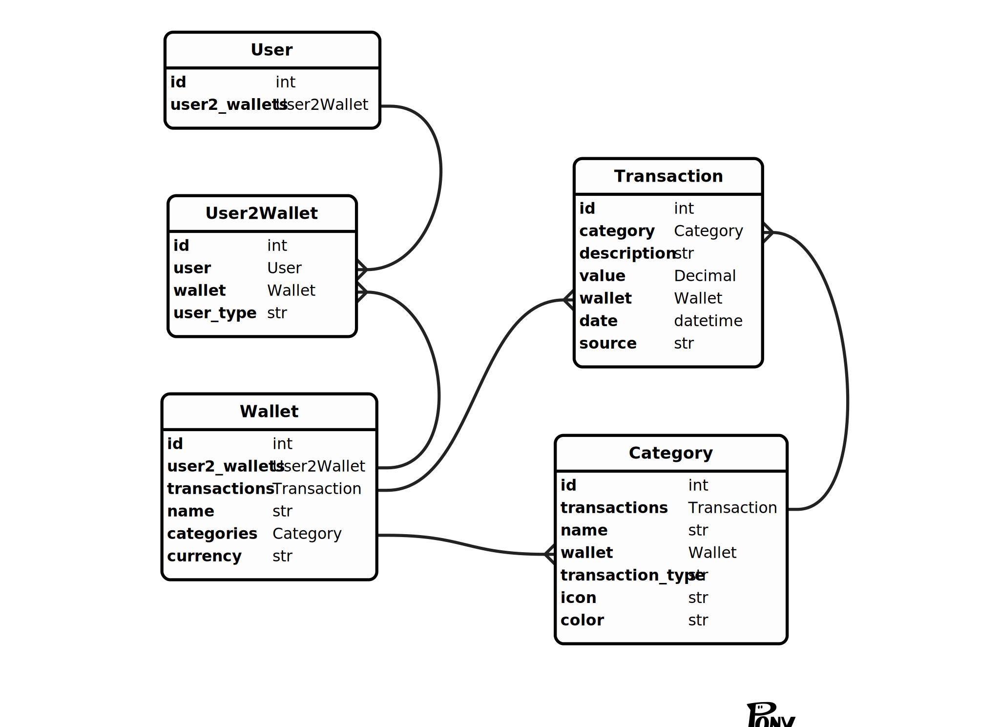

# Cashflow
https://t.me/keepcashflowbot  
Cashflow is an application for financial management and collaborative planning with your loved ones. 

With Cashflow, you can:

1. Track your expenses: No more need for complicated spreadsheets. Cashflow allows you to easily record and monitor all your expenses in a user-friendly interface.

2. Build savings: Plan your savings and goals. Watch as your budget grows to achieve your dreams.

3. Create shared wallets: Invite your friends and family to shared wallets for joint financial management. Shared purchases or trips have become easier!

4. Analyze finances: Cashflow provides convenient reports and analytics to help you better understand where your money is going and how to save.

## Requirements

- docker
- docker-compose

## How to run


1. Create ```.env``` file

Example
```
POSTGRES_USER=admin
POSTGRES_PASSWORD=admin

PGADMIN_DEFAULT_EMAIL=admin@admin.com
PGADMIN_DEFAULT_PASSWORD=root

TOKEN=<your telegram token>
SECRET_KEY=<your secret_key>
```

2. Create ```.env``` file in `/frontend`
Example
```
API_URL=http://localhost:8000
```

3. Run ```docker compose --env-file .env up```

## Database schema



## Services

swagger - http://localhost:8000/docs

pgadmin4 - http://localhost:5050/

frontend - https://0.0.0.0:80/ - should have SSL certificate. This ip should be added to your bot via https://t.me/BotFather 
