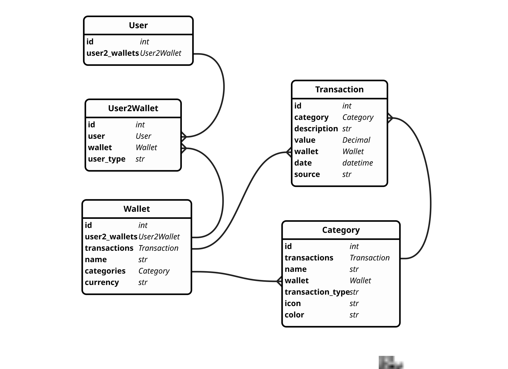

# Cashflow

<p align="center">
  
</p>

[Cashflow](https://t.me/keepcashflowbot) is an application for financial management and collaborative planning with your loved ones.

With Cashflow, you can:

1. **Track your expenses** No more need for complicated spreadsheets. Cashflow allows you to easily record and monitor all your expenses in a user-friendly interface.

2. **Build savings** Plan your savings and goals. Watch as your budget grows to achieve your dreams.

3. **Create shared wallets** Invite your friends and family to shared wallets for joint financial management. Shared purchases or trips have become easier!

4. **Analyze finances** Cashflow provides convenient reports and analytics to help you better understand where your money is going and how to save.
<p align="center">
  
</p>


## Features

- [x] Create unlimited wallets
- [x] Rename wallets
- [x] Set a default wallet for chat-mode transactions
- [x] Edit or create categories for wallets
- [x] Share your wallets via link, inline mode or QR code
- [x] Save transactions: both expenses and incomes
- [x] Quickly record expenses from Telegram chat
- [x] Record multiple chat expenses separated by commas or new lines
- [x] Use math expressions in chat expense amounts, for example `17+17 проезд`
- [x] Store transaction currency and the exchange rate at the moment of purchase
- [x] Configure a default wallet currency
- [x] Keep supported currencies and historical exchange rates in the database
- [x] Calculate charts from USD as the base currency and display totals in the wallet currency
- [x] Support common currencies, including USD, EUR, RUB and KGS
- [x] Migrations and data save
- [ ] Validation of data
- [x] Multi-language support
- [ ] Data import and export
- [ ] One-time link for wallet invitation
- [ ] Invitation link generation permission
- [ ] In-wallet users rename
- [ ] Regular incomes and expenses

## Requirements

- docker
- docker-compose
- Telegram bot token
- ExchangeRate-API key for currency rates

## How to run

1. Create `.env` file

Example:

```env
POSTGRES_HOST=db
POSTGRES_USER=admin
POSTGRES_PASSWORD=admin
POSTGRES_DB=cashflow

PGADMIN_DEFAULT_EMAIL=admin@admin.com
PGADMIN_DEFAULT_PASSWORD=root

TOKEN=<your telegram token>
SECRET_KEY=<your secret_key>

API_URL=http://<your URL>:8000

WEBAPP_TG_URL=https://t.me/<bot_name>/<webapp_name>
WEBAPP_URL=https://<frontend URL>/#/

BOT_SECRET=<secret bot key>
BOT_API_URL=http://backend:8000

EXCHANGE_RATE_API_KEY=<your exchangerate-api key>
```

`EXCHANGE_RATE_API_KEY` is used by the backend to fetch USD-based exchange rates. Rates are cached in the database by date and currency, so the app does not call the external API for every transaction.

2. Run

```bash
docker compose --env-file .env up -d --build
```

## Database schema



## Services

### swagger
```http://<your URL>:8000/docs```

### pgadmin4
```http://<your URL>:5050/```

### frontend
```https://<your URL>:80/```
should have SSL certificate. This ip should be added to your bot via https://t.me/BotFather


## How to do migration

1. Сhange the data schema
2. Run in backend container ```alembic revision --autogenerate -m "YOUR MESSAGE"```
