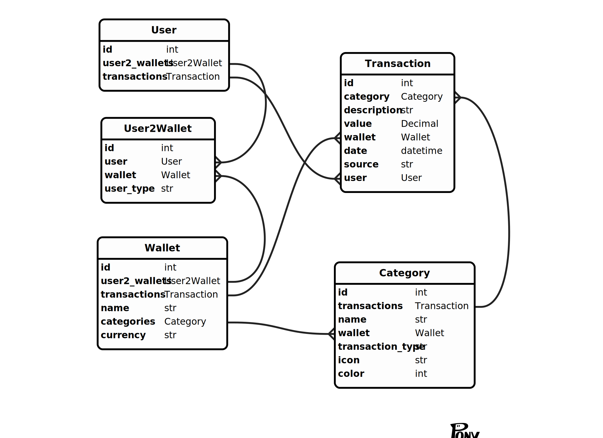

# Cashflow

<p align="center">
  
</p>

[Cashflow](https://t.me/keepcashflowbot) is an application for financial management and collaborative planning with your loved ones. 

With Cashflow, you can:

1. **Track your expenses** No more need for complicated spreadsheets. Cashflow allows you to easily record and monitor all your expenses in a user-friendly interface.

2. **Build savings** Plan your savings and goals. Watch as your budget grows to achieve your dreams.

3. **Create shared wallets** Invite your friends and family to shared wallets for joint financial management. Shared purchases or trips have become easier!

4. **Analyze finances** Cashflow provides convenient reports and analytics to help you better understand where your money is going and how to save.
<p align="center">
  
</p>


## Features

- [x] Create unlimited wallets
- [x] Edit or create categories for wallets
- [x] Share your vallets via link, inline or QR code
- [x] Save transactions: both expenses and incomes
- [ ] Rename existed wallets
- [ ] Validation of data

## Requirements

- docker
- docker-compose

## How to run


1. Create ```.env``` file

Example
```
POSTGRES_HOST=db
POSTGRES_USER=admin
POSTGRES_PASSWORD=admin
POSTGRES_DB=cashflow

PGADMIN_DEFAULT_EMAIL=admin@admin.com
PGADMIN_DEFAULT_PASSWORD=root

TOKEN=<your telegram token>
SECRET_KEY=<your secret_key>

API_URL=http://<your URL>:8000

WEBAPP_TG_URL=https://t.me/<bot_name>/<webapp_name>
WEBAPP_URL="https://<frontend URL>/#/"

BOT_SECRET=<secret bot key>
```


2. Run ```docker compose --env-file .env up```

## Database schema



## Services

### swagger
```http://<your URL>:8000/docs```

### pgadmin4
```http://<your URL>:5050/```

### frontend
```https://<your URL>:80/```
should have SSL certificate. This ip should be added to your bot via https://t.me/BotFather 


## How to do migration

1. Сhange the data schema 
2. Run in backend container ```alembic revision --autogenerate -m "YOUR MESSAGE"```
